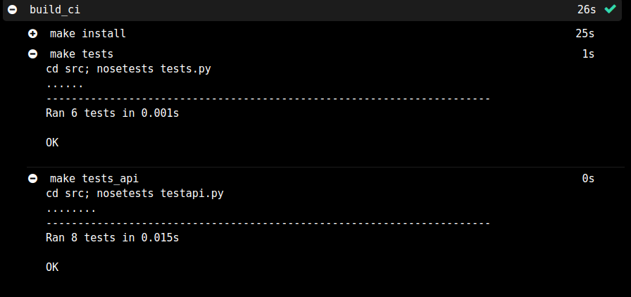

# Proyecto IV - GestEnergy
Documentación adicional del proyecto.

## Índice
* [Descripción del proyecto](#descripcion)
* [Implementación](#implementacion)
* [Descripción de la clase](#clase)
* [Herramientas de construcción y prueba](#tests)
* [Integración contínua](#CI)
  * [Travis CI](#travis)
  * [shippable](#shi)
* [Descripción de la api y del servicio](#api_ser)

  
## Descripción

   Microservicio para la gestión clientes de una empresa de energia, en el que se podrán realizar búsquedas sobre datos de clientes.

  El motivo por el que solo se pueden obtener datos y no modificarlos,borrarlos o añadirlos, es porque esta pensada para trabajadores que no tendrán estos privilegios. Simplemente se encargarán de llamar al cliente para ofrecer nuevas ofertas, comprobar sus datos, ofrecerles la mejor opcion a cada uno y que asi tengan un contrato hecho a medida y acorde a sus horarios y estilos de vida.

  Todos los datos de clientes estarán almacenados en un archivo que contendrá: nombre, apellidos, dirección, estado(baja/alta), energía contratada (electricidad,gas), potencia, Cups, provincia,DNI, teléfono, dirección.

  
## Implementación

  - Para desarrollarla voy a utilizar el lenguaje **[Python](https://wiki.archlinux.org/index.php/Python)** y el framework **[Flask](http://flask.palletsprojects.com/en/1.1.x/)**.

  - Como entorno virtual de python utilizaré **[Pipenv](https://pipenv-es.readthedocs.io/es/latest/)**.

  - Los datos se almacenarán en una base de datos NoSQL, **[MongoDB](https://www.mongodb.com/es)**

  - Para el registro de logs uso de logstash (ELK) con la biblioteca **[logging](https://docs.python.org/3/library/logging.html)**

  - Para testear nuestra clase se usará [nosetest](https://nose.readthedocs.io/en/latest/).

  - Travis CI para [integración contínua](https://github.com/patriciamaldonado/GestEnergy/blob/master/docs/documentacion.md)

  
## Descripción de la clase

Se va a testear la clase Clientes. Esta clase consta de métodos para la búsqueda de información sobre un cliente.

- **mostrarClientes**: devuelve un listado con todos los clientes actuales.
- **busquedaPorNombre**: busca clientes filtrando por nombre.
- **busquedaPorDNI**: busca un cliente en concreto filtrando por DNI.
- **busquedaPorProvincia**: busca clientes filtrando por provincia.
- **busquedaPorEstado**: busca un cliente filtrando por estado(baja/alta). Útil para obtener por ejemplo todos los clientes de baja e ir llamándolos para convencerlos de que vuelvan a la compañia. O bien obtener los que estén de alta para llamarlos y mejorarles su tarifa.
- **busquedaPorRobinson**: busca un cliente a través de su DNI para comprobar si se trata de un cliente Robinson, si se trata de un cliente Robinson te indica con un mensaje que a ese cliente no se le pueden ofrecer ofertas, en caso contrario muestra la información de ese cliente. Esto es útil cuando se quiere saber con rapidez si se puede llamar a un cliente.

- [Enlace a la clase Clientes](https://github.com/patriciamaldonado/GestEnergy/blob/master/src/clientes.py)

## Herramientas de construcción y prueba
  
### Tests Unitarios
Para testear la clase Clientes, se ha usado nosetest.

Ejecución de tests unitarios:
>  make test

Se testean todos los métodos de la clase y además del método para comprobar si se ha inicializado bien.
- **testBusquedaPorNombre**: Se testea que no se haya introducido un número, busqueda vacía y que exista ese nombre.
- **testBusquedaPorDNI**: Se testea que no se haya introducido una busqueda vacía y que exista ese DNI.
- **testBusquedaPorProvincia**:  Se comprueba que no se haya introducido un número, busqueda vacía y que exista la provincia que se introduzca.
- **testBusquedaPorEstado**: se comprueba que el estado que se haya introducido sea uno de los dos posibles (alta o baja), que no se introduzca un número, ni una búsqueda vacía.
- **testRobinson**: testea cuando un cliente introducido sea robinson devuelva el mensaje "No puede ofrecer ofertas a este cliente"

- [Enlace al archivo de tests unitarios](https://github.com/patriciamaldonado/GestEnergy/blob/master/src/tests.py)

  
### Tests de integración
Para los tests de integración se ha testeado la api.

Ejecución de tests de integración:
>  make tests_api
- [Enlace al archivo de la api](https://github.com/patriciamaldonado/GestEnergy/blob/master/src/main.py)

Es fundamental comprobar:
 - que el estado que se ha devuelto sea el correcto (status = OK)
 - el código devuelto sea 200
 - y además que el contenido devuelto sea el correcto, en este caso que se devuelva contenido JSON.

Sin olvidarnos de comprobar si la URL introducida es correcta (error 404), esto se ha controlado desde la misma api.

- [Enlace al archivo de tests de integración ](https://github.com/patriciamaldonado/GestEnergy/blob/master/src/testapi.py)

## Integración continua

Para integración continua se va a usar Travis CI,éste clona el repositorio a un entorno virtual para construir y probar tu código. Además como CI adicional se usará Shippable.
Es fundamental detectar todos los fallos para posteriormente desplegar una versión correcta.
Con Travis se va a probar el servicio, iniciarlo, reiniciarlo, pararlo... y con Shippable se van a ejecutar los tests unitarios y test de integración.

### Configuración Travis CI para Python

1. Para empezar hay que ingresar con nuestra cuenta de Github en [Travis](https://travis-ci.com/) y permitir el acceso al repositorio del proyecto.
2. Añadir un archivo .travis.yml en la raíz de nuestro repositorio, en este archivo se incluye el lenguaje, las versiones de python a probar,instalar librerias, ejecución de test...

      - Podemos añadir comandos para que se ejecuten antes de la instalación (before_install).Instalar la útima versión de pip                  (pip install -U pip),comprobar versión en la que se está ejecutando con (python --version)                     
      - Con respecto a las versiones elegidas para probar nuestro código en python, no es recomendable usar inferiores a la 3.X   ya que la versión 2.7 no podrá utlizarse a partir de 2020. Por este motivo se probará en las versiones 3.X.
      Se ha probado la versión 3.7  y la versión 3.7-dev, ya que estsa versiones son recientes y no han llegado a su end-of-life.
      -  Las dependencias que necesitamos para nuestro proyecto se definen en en archivo requirements.txt, actualmente solo contiene la versión de flask y versión de gunicorn.
      - La herramienta de construcción utlizada es Makefile con la que podremos instalar lo necesario ejecutando el comando make install.
      - Además Travis se encargará de iniciar el servicio, pararlo, reiniciarlo..etc.
          - make start
          - make stop
          - make restart
          - make show
          - make delete

3. Una vez que tengamos configurado nuestro archivo .travis.yml correctamente, cada vez que hagamos git push se verificará si ha ido todo correctamente.

    - [Archivo de travis](https://github.com/patriciamaldonado/GestEnergy/blob/master/.travis.yml)
    - [Requirements](https://github.com/patriciamaldonado/GestEnergy/blob/master/requirements.txt)
    - [Makefile](https://github.com/patriciamaldonado/GestEnergy/blob/master/Makefile)

### Configuración shippable para Python
  Como CI extra se ha elegido shippable.
  Para configurar shippable tenemos que ingresar en la página [shippable](https://app.shippable.com) y permitir acceso a nuestra cuenta de Github.
  Creamos un archivo llamado .shippable.yml en el que añadimos el lenguaje, versiones del lenguaje a probar,instalación de dependecias y los comandos necesarios para la ejecución de test.
  - Para la ejecución de los tests ejecutamos make tests y make testapi se situa en la carpeta contenedora del test y lo testea mediante nosetest.

  [Archivo de shippable](https://github.com/patriciamaldonado/GestEnergy/blob/master/.shippable.yml)

 Podemos comprobar que los test se han ejecutado correctamente.
   
   

  
## Descripción de la api
   Para crear la aplicación se ha utlizado el framework Flask.

   A continuación se describen las diferentes rutas de la API.

   | URI | Parámetros | Método | Descripción |
   | :---: | :---: | :---: |---|
   | / | | GET | Devuelve el estado de la api: status OK |
   | /status | | GET | Devuelve el estado de la api: status OK |
   | /mostrar | | GET | Devuelve un JSON con todos los clientes |
   | /clientes | nombre | GET | Devuelve un JSON con ese cliente |
   | /clientes | estado | GET | Devuelve un JSON con los clientes con ese estado (baja/alta)|
   | /provincia | provincia| GET | Devuelve un JSON con los clientes de esa provincia |
   | /robinson | DNI | GET | Devuelve un JSON con los datos del cliente perteneciente ese DNI (si no es Robinson) |
   | /DNI | DNI| GET | Devuelve un JSON con los datos del cliente perteneciente ese DNI  |

    - Además de estas rutas, se ha controlado el error 404, cuando se introduce una URL incorrecta devuelve un JSON: {"error":"404 Not Found: The requested URL was not found on the server. If you entered the URL manually please check your spelling and try again."}

   - [Enlace al archivo de la api](https://github.com/patriciamaldonado/GestEnergy/blob/master/src/main.py)

   ## Servicio

   Se va a usar el gestor de procesos pm2 con gunicorn.

   #### Arrancar el servicio
   Para iniciar el servicio usamos pm2 start

   > pm2 start 'gunicorn main:app -b 0000:5000 -w 2' --name "api"

   En este ejemplo se ha iniciado el servicio en la dirección y puerto 0000:5000 con 2 workers, además le establecemos un alias "api",que nos servirá posteriormente para parar la api, reiniciarla,etc... Aunque también podemos referirnos a ella mediante el id.

   #### Detener el servicio

   > pm2 stop api

   #### Reiniciar el servicio

   > pm2 restart api

   #### Eliminar el servicio

   > 	pm2 delete api

   Éste se elimina de la lista de procesos.

   #### Obtener más detalles sobre el servicio

   > pm2 show api
