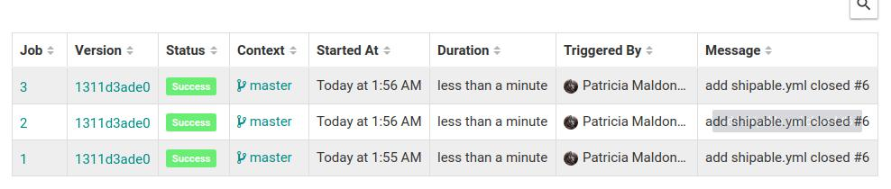
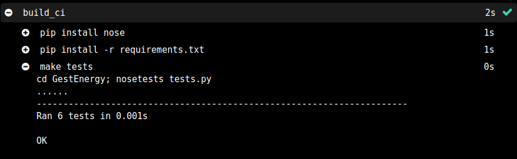

# Proyecto IV - GestEnergy
Documentación más específica del proyecto.

## Integración contínua

Para integración contínua se va a usar Travis CI,éste clona el repositorio a un entorno virtual para construir y probar tu código. Es fundamental detectar todos los fallos para posteriormente desplegar una versión correcta.

### Configuración Travis CI para Python

1. Para empezar hay que ingresar con nuestra cuenta de Github en [Travis](https://travis-ci.com/) y permitir el acceso al repositorio del proyecto.
2. Añadir un archivo .travis.yml en la raíz de nuestro repositorio, en este archivo se incluye el lenguaje, las versiones de python a probar,instalar librerias, ejecución de test...

      - Podemos añadir comandos para que se ejecuten antes de la instalación (before_install).Instalar la útima versión de pip                  (pip install -U pip),comprobar versión en la que se está ejecutando con (python --version)                     
      - Con respecto a las versiones elegidas para probar nuestro código en python, no es recomendable usar inferiores a la 3.X   ya que la versión 2.7 no podrá utlizarse a partir de 2020. Por este motivo se probará en las versiones 3.X.
      -  Las dependencias que necesitamos para nuestro proyecto se definen en en archivo requirements.txt, actualmente solo contiene la versión de flask que se podría usar. Se instala mediante el comando pip3 install -r requirements.txt.
      - Para la ejecución de los test se ha utlizado un Makefille que mediante la orden make tests, se situa en la carpeta contenedora del test y lo testea mediante nosetest.

3. Una vez que tengamos configurado nuestro archivo .travis.yml correctamente, cada vez que hagamos git push se verificará si se pasan los test o fallan.

    - [Archivo de travis](https://github.com/patriciamaldonado/GestEnergy/blob/master/.travis.yml)
    - [Requirements](https://github.com/patriciamaldonado/GestEnergy/blob/master/requirements.txt)
    - [Makefile](https://github.com/patriciamaldonado/GestEnergy/blob/master/Makefile)

### Configuración shippable para Python

  Para configurar shippable tenemos que ingresar en la página [shippable](https://app.shippable.com) y permitir acceso a nuestra cuenta de Github.
  Creamos un archivo llamado .shippable.yml en el que añadimos el lenguaje, versiones del lenguaje a probar y los comandos necesarios para la ejecución de test.

  [Archivo de shippable](https://github.com/patriciamaldonado/GestEnergy/blob/master/.shippable.yml)

 Podemos comprobar que los test se han ejecutado correctamente.
   
   
